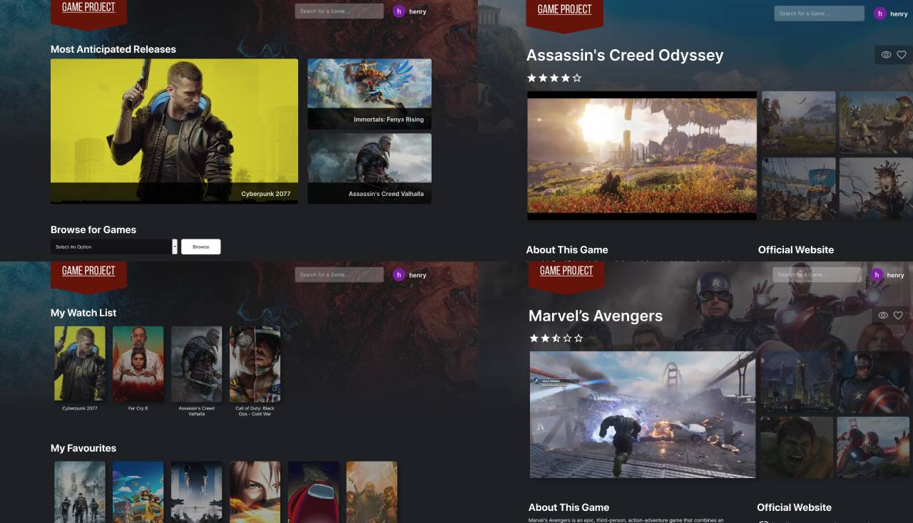

# The Game Project

Game Project is a website to browse through trending and popular games. 

Game Project was built using React, HTML/CSS, SASS, Express, and MongoDB. Authentication was  
implemented with Passport.js using OAuth 2.0 flow. Figma and Adobe Creative Suite were used  
for prototyping and design.

See the project hosted at https://gameproject.netlify.app

Repository for Node.js server at https://github.com/henryliang2/game-project-backend

## Resources Used

Stack: React, Express, MongoDB, SASS  
API: [RAWG api](https://api.rawg.io/docs/)  
Icons: [Material-UI](https://material-ui.com/)
